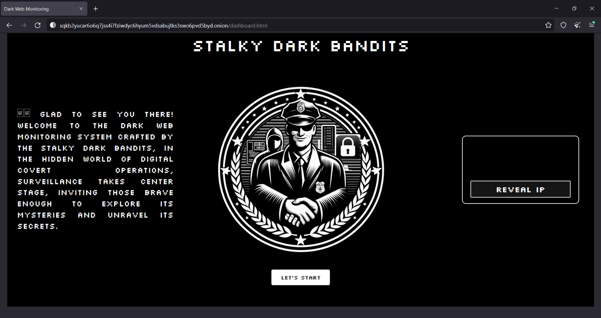

# Stalky Dark Bandits

## Team Members

- Multansingh Medtiya
- Tirth Patel
- Adharv Shine
- Yuvraj Badgoti

## Problem Statement: Dark Web Monitoring

We aim to develop a tool for monitoring the Dark Web, a hidden part on the internet, to track illegal activities. The tool will include a scraper and crawler that will consistently collects onion sites, crawling for keywords associated with illegal activities such as drugs. For enhanced anonymity, the entire tool will operate on Tails OS, which utilizes relays and Tor services to take anonymity to the next level. Furthermore, the solution or tool service will host itself on the Dark Web for added security.

## Features

- Dark web scraper and crawler
- Keyword tracking for illegal activities
- Utilizes Tails OS for enhanced anonymity
- Hosted on the dark web for added security

## Tool Preview

**Important:** We are mostly focused on Research and Development, so practical aspects or source code updates may occur slowly.
